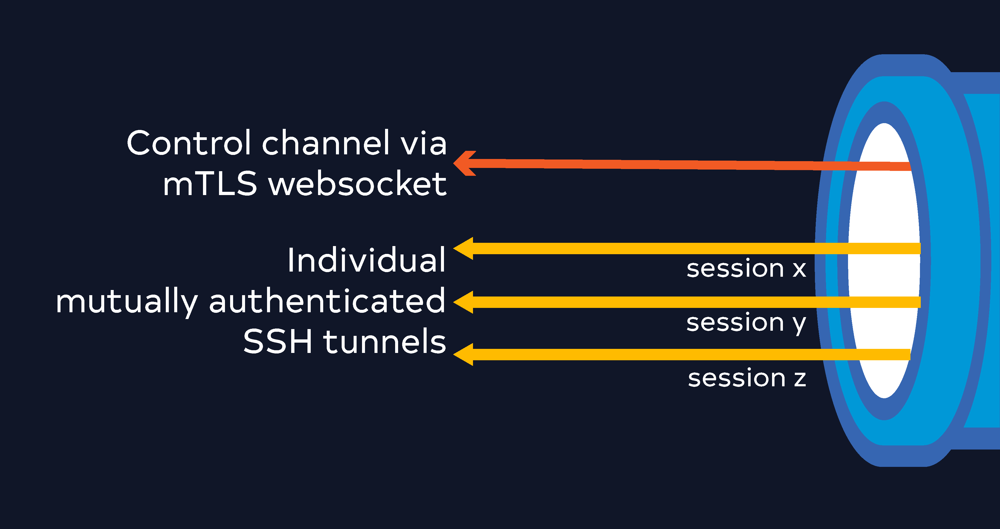

# Excalibur Tunnel Client

**Secure**, **robust**, **dynamic**, and **production-grade** tunnel client for connecting **local networks** to **cloud-hosted Excalibur SAM (Streamed Access Management)** instance using **mutually authenticated (mTLS)** and **end-to-end encrypted connections**.


## 📖 Overview

The **Excalibur Tunnel Client** is a key component of the **Excalibur Tunnel technology**, designed to securely connect **local networks** to the **Excalibur Cloud**. This enables seamless access to **SAM (Streamed Access Management)** resources hosted in local networks from the **cloud-hosted Excalibur** environment.

It provides a **secure** and **reliable** connection between your local network and the Excalibur Cloud, leveraging **mutual TLS (mTLS)** for authentication and encryption to ensure that your data is always protected. The client is built with a focus on **security**, **reliability**, and **ease of use**, making it suitable for both **developers** and **system administrators**. Its **simple installation** and **configuration** process ensure a smooth user experience.

- [Excalibur Tunnel Client](#excalibur-tunnel-client)
  - [📖 Overview](#-overview)
    - [🌐 Connection Architecture](#-connection-architecture)
      - [Types of Connections](#types-of-connections)
      - [Control Channel Details](#control-channel-details)
      - [Data Channel Details](#data-channel-details)
      - [Key Management](#key-management)
      - [Summary of Security Features](#summary-of-security-features)
  - [✨ Key Features](#-key-features)
  - [🚀 Installation Guide](#-installation-guide)
    - [📋 Prerequisites](#-prerequisites)
    - [Debian](#debian)
      - [Download](#download)
      - [Install](#install)
      - [Verify Installation](#verify-installation)
      - [Compatibility](#compatibility)
      - [Verify Installation with systemd](#verify-installation-with-systemd)
      - [Activate](#activate)
    - [Red Hat](#red-hat)
      - [Download](#download-1)
      - [Install](#install-1)
      - [Verify Installation](#verify-installation-1)
      - [Compatibility](#compatibility-1)
      - [Verify Installation with systemd](#verify-installation-with-systemd-1)
      - [Activate](#activate-1)
    - [MSI Installer](#msi-installer)
      - [Work in Progress](#work-in-progress)
  - [⚙️ Management of the Excalibur Tunnel Client](#️-management-of-the-excalibur-tunnel-client)
    - [Start the Service](#start-the-service)
    - [Stop the Service](#stop-the-service)
    - [Restart the Service](#restart-the-service)
    - [Check the Service Status](#check-the-service-status)
  - [🔐 Activation](#-activation)
    - [Command](#command)
    - [Process Overview](#process-overview)
    - [Data Sent to the Server](#data-sent-to-the-server)
    - [Data Received from the Server](#data-received-from-the-server)
    - [File Storage](#file-storage)
  - [Deactivation](#deactivation)
  - [🗑️ Uninstalling the Excalibur Tunnel Client](#️-uninstalling-the-excalibur-tunnel-client)
    - [Debian-based Systems](#debian-based-systems)
    - [Red Hat-based Systems](#red-hat-based-systems)
  - [📞 Support](#-support)
  - [🙏 Acknowledgments](#-acknowledgments)

### 🌐 Connection Architecture

The Excalibur Tunnel Client connects to the Excalibur Tunnel Server using **mutual TLS (mTLS)**, ensuring that both the client and the server authenticate each other using certificates. This establishes a secure, encrypted connection.

The client uses the **CA chain**, **signed certificate**, and **private key** to establish the connection. The connections are established using details returned by the Excalibur API during activation. After successful activation, the configuration details, including the information returned from the server, are stored in the `conf.toml` file located under the `/etc/excalibur/tunnel/` folder. This ensures that the client can persistently use the configuration for subsequent operations.

#### Types of Connections

1. **Control Channel**: Used to send and receive control messages to/from the Excalibur Tunnel Server. This channel manages the overall operation of the tunnel.
2. **Data Channel**: Used to open a tunnel connecting the local network to the Excalibur Cloud. This channel is created on demand and supports multiple simultaneous data connections.



#### Control Channel Details

The **control channel** is implemented as an **mTLS WebSocket** connection. It uses **JSON-RPC 2.0** for messaging, enabling structured and efficient communication between the client and the server. The control channel is responsible for:

-   **Session Management**: Establishing and maintaining the tunnel session.
-   **Command Exchange**: Sending and receiving commands, such as requests to create or close data channels.
-   **Heartbeat Mechanism**: Ensuring the connection remains active and detecting any disruptions.

#### Data Channel Details

The **data channel** is created on demand by the server upon request. It is implemented as an **mTLS SSH** connection, ensuring secure and encrypted communication. Each **SAM (Streamed Access Management)** session has its own dedicated data channel. The data channel operates as follows:

-   **Protocol**: SSH with mTLS for authentication and encryption.
-   **Purpose**: Remote port forwarding to route remote connections and traffic to a local destination.
-   **Lifecycle**: Created on demand by the server and closed when the SAM session ends.
-   **Scalability**: Supports multiple simultaneous data channels, one for each SAM session.

The **remote port forwarding** feature of the SSH protocol allows the Excalibur Tunnel Client to listen on a local port and forward the traffic to the local target. This ensures that remote connections can seamlessly access local resources.

#### Key Management

Key management is a critical aspect of the Excalibur Tunnel architecture. The following steps outline how keys are generated and used:

1. **Server Keys**: When a tunnel is created on the backend via the administrator dashboard, the server keys are generated. Each tunnel has its own unique set of keys.
2. **Client Keys**: The client keys are generated locally on the machine where the Excalibur Tunnel Client is installed. These keys use the **Elliptic Curve P-256 (EC P-256)** algorithm, ensuring high security and efficiency. This ensures that the private key never leaves the local environment, enhancing security.
3. **Certificate Signing Request (CSR)**: During activation, the client generates a CSR using its private key. This CSR is sent to the Excalibur API, which signs it and issues a certificate.
4. **Certificate Issuance**: The signed certificate and the CA chain are returned to the client. These are used to establish the mTLS connection with the server.

This approach ensures that each tunnel has its own unique set of keys and certificates, providing a high level of security and isolation. The configuration details are stored in the `conf.toml` file under `/etc/excalibur/tunnel/` for persistent use.

#### Summary of Security Features

-   **Mutual TLS (mTLS)**: Ensures that both the client and the server authenticate each other.
-   **Unique Keys for Each Tunnel**: Enhances security and prevents key reuse.
-   **Local Key Generation**: Ensures that private keys remain secure and are never transmitted.
-   **Certificate-Based Authentication**: Provides a robust mechanism for verifying the identity of the client and server.
-   **Persistent Configuration**: Stores server-provided information securely in `conf.toml` for reliable operation.

By combining these features, the Excalibur Tunnel Client provides a secure, reliable, and scalable solution for connecting local networks to the Excalibur Cloud.

<!--  -->

## ✨ Key Features

<table>
  <tr>
    <td>
      <h3>🔒 Secure by Design</h3>
      <ul>
        <li>End-to-end encryption using mTLS</li>
        <li>Certificate-based authentication</li>
        <li>Secure storage of credentials</li>
      </ul>
    </td>
    <td>
      <h3>🔄 Reliable Connections</h3>
      <ul>
        <li>Automatic reconnection</li>
        <li>Multiple data channels</li>
        <li>Robust control protocol</li>
      </ul>
    </td>
  </tr>
  <tr>
    <td>
      <h3>⚙️ Easy Management</h3>
      <ul>
        <li>Simple systemd service integration</li>
        <li>Straightforward configuration</li>
        <li>Comprehensive logging</li>
      </ul>
    </td>
    <td>
      <h3>🌐 Cross-Platform</h3>
      <ul>
        <li>Debian/Ubuntu packages</li>
        <li>Red Hat/CentOS packages</li>
        <li>Other Linux distributions</li>
        <li>Windows MSI installer packages</li>
      </ul>
    </td>
  </tr>
</table>

## 🚀 Installation Guide

### 📋 Prerequisites

Before installing the Excalibur Tunnel Client, ensure your system meets the following requirements:

-   **Operating System**: Linux (Debian/Ubuntu or Red Hat/CentOS)
-   **Privileges**: Administrative (sudo) privileges
-   **Network**: Connectivity to the Excalibur Cloud
-   **Activation Code**: Provided by Excalibur Enterprise

---

### Debian

#### Download

The Excalibur Tunnel Client is available as a `.deb` package. You can download it using `curl` or `wget`. The latest release can be found on the [GitHub Releases page](https://github.com/excalibur-enterprise/excalibur-tunnel-client/releases).

```bash
curl -sL https://github.com/excalibur-enterprise/excalibur-tunnel-client/releases/download/<version>/excalibur-tunnel_<version>_amd64.deb -o excalibur-tunnel_<version>_amd64.deb
```

Alternatively, you can use `wget`:

```bash
wget https://github.com/excalibur-enterprise/excalibur-tunnel-client/releases/download/<version>/excalibur-tunnel_<version>_amd64.deb
```

#### Install

The downloaded package can be installed using the `dpkg` command. Ensure you have administrative privileges (sudo) to perform the installation.

```bash
sudo dpkg -i excalibur-tunnel_<version>_amd64.deb
```

If there are missing dependencies, you can resolve them by running:

```bash
sudo apt-get install -f
```

This command will automatically install any required dependencies for the Excalibur Tunnel Client.

#### Verify Installation

After installation, you can verify that the Excalibur Tunnel Client is installed correctly by checking its version:

```bash
excalibur-tunnel --version
```

This should display the installed version of the client.

#### Compatibility

The `.deb` package is compatible with Debian-based distributions, including Ubuntu, Linux Mint, and others. Ensure your system meets the minimum requirements before proceeding with the installation.

#### Verify Installation with systemd

The Excalibur Tunnel Client is installed as a systemd service. You can verify its status using the following command:

```bash
sudo systemctl status excalibur-tunnel
```

If the service is running, you should see an "active (running)" status. If not, you can start the service with:

```bash
sudo systemctl start excalibur-tunnel
```

#### Activate

The activation command is used to set up the tunnel client with the server URL and activation code. Replace `<server-url>` and `<code>` with the actual values provided by your Excalibur administrator dashboard.

```bash
sudo excalibur-tunnel activate --server-url <server-url> --code <code>
```

For detailed activation instructions, refer to the Activation section.

### Red Hat

#### Download

The Excalibur Tunnel Client is available as an `.rpm` package. You can download it using `curl` or `wget`. The latest release can be found on the [GitHub Releases page](https://github.com/excalibur-enterprise/excalibur-tunnel-client/releases).

```bash
curl -sL https://github.com/excalibur-enterprise/excalibur-tunnel-client/releases/download/<version>/excalibur-tunnel-<version>.x86_64.rpm -o excalibur-tunnel-<version>.x86_64.rpm
```

Alternatively, you can use `wget`:

```bash
wget https://github.com/excalibur-enterprise/excalibur-tunnel-client/releases/download/<version>/excalibur-tunnel-<version>.x86_64.rpm
```

#### Install

The downloaded package can be installed using the `rpm` command. Ensure you have administrative privileges (sudo) to perform the installation.

```bash
sudo rpm -i excalibur-tunnel-<version>.x86_64.rpm
```

If there are missing dependencies, you can resolve them by running:

```bash
sudo yum install -y <missing-dependency>
```

This command will automatically install any required dependencies for the Excalibur Tunnel Client.

#### Verify Installation

After installation, you can verify that the Excalibur Tunnel Client is installed correctly by checking its version:

```bash
excalibur-tunnel --version
```

This should display the installed version of the client.

#### Compatibility

The `.rpm` package is compatible with Red Hat-based distributions, including CentOS, Fedora, and others. Ensure your system meets the minimum requirements before proceeding with the installation.

#### Verify Installation with systemd

The Excalibur Tunnel Client is installed as a systemd service. You can verify its status using the following command:

```bash
sudo systemctl status excalibur-tunnel
```

If the service is running, you should see an "active (running)" status. If not, you can start the service with:

```bash
sudo systemctl start excalibur-tunnel
```

#### Activate

The activation command is used to set up the tunnel client with the server URL and activation code. Replace `<server-url>` and `<code>` with the actual values provided by your Excalibur administrator dashboard.

```bash
sudo excalibur-tunnel activate --server-url <server-url> --code <code>
```

For detailed activation instructions, refer to the Activation section.

### MSI Installer

#### Work in Progress

The MSI installer for the Excalibur Tunnel Client is currently under development and will be available soon. Stay tuned for updates on our [GitHub Releases page](https://github.com/excalibur-enterprise/excalibur-tunnel-client/releases).

## ⚙️ Management of the Excalibur Tunnel Client

The Excalibur Tunnel Client can be managed using `systemctl`. The service is named `excalibur-tunnel`. Below are the commands for managing the service:

### Start the Service
To start the Excalibur Tunnel Client service, use the following command:
```bash
sudo systemctl start excalibur-tunnel
```
This will initialize and run the tunnel client.

### Stop the Service
To stop the Excalibur Tunnel Client service, use the following command:
```bash
sudo systemctl stop excalibur-tunnel
```
This will terminate the tunnel client service.

### Restart the Service
To restart the Excalibur Tunnel Client service, use the following command:
```bash
sudo systemctl restart excalibur-tunnel
```
This is useful for applying configuration changes or recovering from errors.

### Check the Service Status
To check the current status of the Excalibur Tunnel Client service, use the following command:
```bash
sudo systemctl status excalibur-tunnel
```
This will display whether the service is active, inactive, or has encountered any issues.

## 🔐 Activation

The activation process is a critical step to securely connect the Excalibur Tunnel Client to the Excalibur Tunnel Server. Below are the detailed steps and data involved in the activation process:

### Command

To activate the client, use the following command:

```bash
sudo excalibur-tunnel activate --server-url <server-url> --code <code>
```

Replace `<server-url>` with the URL of the Excalibur Server and `<code>` with the activation code provided by your Excalibur administrator. The whole link can be found in the Excalibur administrator dashboard and copied to the clipboard.

### Process Overview

1. **Private Key Generation**: A private key is generated and stored locally.
2. **Certificate Signing Request (CSR)**: A CSR is created using the private key.
3. **API Request**: The CSR and activation code are sent to the Excalibur API.
4. **Certificate Issuance**: The API returns a signed certificate and CA chain.
5. **Configuration Storage**: The signed certificate and CA chain are stored locally for persistent use.

### Data Sent to the Server

The following data is sent to the Excalibur API during activation:

| Field       | Type   | Description                              | Example                                  |
|-------------|--------|------------------------------------------|------------------------------------------|
| `csr`       | String | The certificate signing request.         | `MIIBIjANBgkqhkiG9w0BAQEFAAOCAQ8AMIIBCgKCAQ...` |
| `code`      | String | The activation code provided by Excalibur. | `ABC123XYZ`                              |


### Data Received from the Server

The following data is returned by the Excalibur API upon successful activation:

| Field             | Type   | Description                                      | Example                                  |
|-------------------|--------|--------------------------------------------------|------------------------------------------|
| `certificate`     | String | The signed certificate issued by the server.     | `MIIC+DCCAeCgAwIBAgIRAK...`              |
| `chain`           | String | The CA chain for verifying the server identity.  | `MIIDdzCCAl+gAwIBAgIRAK...`              |

### File Storage

After activation, the following files are created and stored securely:

| File Path                                | Description                          |
|-----------------------------------------|--------------------------------------|
| `/var/lib/excalibur/tunnel/private`     | Contains the generated private key.  |
| `/var/lib/excalibur/tunnel/certs`       | Contains the signed certificate and CA chain. |
| `/etc/excalibur/tunnel/conf.toml`       | Contains the configuration details for the tunnel client. |

This ensures that the client is ready to establish secure connections with the Excalibur Tunnel Server.

## Deactivation

During the deactivation process, the private key and certificate are removed from the path `/var/lib/excalibur/tunnel/private` and `/var/lib/excalibur/tunnel/certs` respectively. The deactivation command is as follows:

```bash
sudo excalibur-tunnel deactivate
```

This ensures that the client is securely deactivated and no longer has access to the Excalibur Tunnel Server.

## 🗑️ Uninstalling the Excalibur Tunnel Client

To uninstall the Excalibur Tunnel Client, use the following commands based on your package manager:

### Debian-based Systems
```bash
sudo apt-get remove --purge excalibur-tunnel
```

### Red Hat-based Systems
```bash
sudo yum remove excalibur-tunnel
```

> [!WARNING]
> Uninstalling the Excalibur Tunnel Client will remove all associated keys and configuration files. After reinstallation, you will need to perform a new activation process to re-establish the tunnel.

## 📞 Support

Having issues or need help? We're here to assist you!

- For issues or feature requests, please use the [Issue Tracker](https://github.com/excalibur-enterprise/excalibur-tunnel-client/issues) in this repository.

## 🙏 Acknowledgments

We sincerely thank all contributors, users, and supporters of the Excalibur Tunnel Client project. For detailed acknowledgments and notices, please refer to [NOTICE.md](./notice.md).

---

<div align="center">
  <p>
    <sub>Built with ❤️ by <a href="https://getexcalibur.com">Excalibur Enterprise</a></sub>
  </p>
  <p>
    <sub>© 2023 Excalibur Enterprise. All rights reserved. <a href="LICENSE">License</a></sub>
  </p>
</div>
