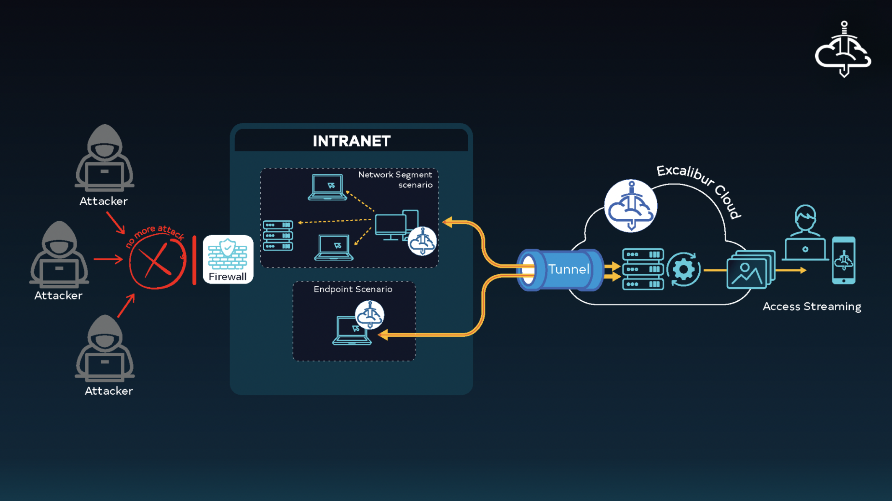

# Excalibur Tunnel Client

## Installation Guide

### Debian

#### Download

The Excalibur Tunnel Client is available as a `.deb` package. You can download it using `curl` or `wget`.

```shell
curl -sL https://github.com/excalibur-enterprise/excalibur-tunnel-client/releases/download/v4.0.0/excalibur-tunnel_4.0.0-1_amd64.deb
```

#### Install

The downloaded package can be installed using `dpkg`.

```shell
sudo dpkg -i excalibur-tunnel_4.0.0-1_amd64.deb
```

#### Activate

The activation command is used to set up the tunnel client with the server URL and activation code. Replace `<server-url>` and `<code>` with the actual values.

```shell
sudo excalibur-tunnel activate --server-url <server-url> --code <code>
```

### Red Hat

#### Download

The Excalibur Tunnel Client is available as an `.rpm` package. You can download it using `curl` or `wget`.

```shell
curl -sL https://github.com/excalibur-enterprise/excalibur-tunnel-client/releases/download/v4.0.0/excalibur-tunnel-4.0.0-1.x86_64.rpm
```

#### Install

The downloaded package can be installed using `rpm`.

```shell
sudo rpm -i excalibur-tunnel-4.0.0-1.x86_64.rpm
```

#### Activate

The activation command is used to set up the tunnel client with the server URL and activation code. Replace `<server-url>` and `<code>` with the actual values.

```shell
sudo excalibur-tunnel activate --server-url <server-url> --code <code>
```

### Management of the Excalibur Tunnel Client
The Excalibur Tunnel Client can be managed using `systemctl`. The service is named `excalibur-tunnel`.

The systemctl commands can be used to start, stop, restart, and check the status of the Excalibur Tunnel Client.

```shell
sudo systemctl start excalibur-tunnel # Start the Excalibur Tunnel Client
sudo systemctl stop excalibur-tunnel # Stop the Excalibur Tunnel Client
sudo systemctl restart excalibur-tunnel # Restart the Excalibur Tunnel Client
sudo systemctl status excalibur-tunnel # Check the status of the Excalibur Tunnel Client
```

## Activation

The activation command is as follows:

```shell
sudo excalibur-tunnel activate --server-url <server-url> --code <code>
```

During the activation process, the private key is generated and stored in the path /var/lib/excalibur/tunnel/private. With the generated private key, a certificate signing request is created and sent to the Excalibur API with the following body:
```json
{
  "csr": "<string: certificate signing request>",
  "code": "<string: activation code>"
}
```

The Excalibur API will sign the CSR and return a signed certificate and also returns the CA chain. The Excalibur Tunnel Client will then store the signed certificate in the path /var/lib/excalibur/tunnel/certs

response:
```json
{
  "certificate": "<string: signed certificate>",
  "chain": "<string: CA chain>",
  "tunnelHost": "<string: tunnel host>",
  "tunnelProxyUrl": "<string: tunnel proxy url>",
}
```

## Deactivation

During the deactivation process, the private key and certificate are removed from the path /var/lib/excalibur/tunnel/private and /var/lib/excalibur/tunnel/certs respectively.

```shell
sudo excalibur-tunnel deactivate
```

## Conf.toml

The Excalibur Tunnel Client uses a configuration file named `conf.toml` to store the configuration settings. The configuration file is located at `/etc/excalibur/tunnel/conf.toml`. The configuration file is in TOML format and contains the following sections:

```toml
[general]
server_url = '<string: server url>'  # URL for Excalibur API endpoints

[tunnel]
host = '<string: tunnel service host>'  # Hostname for the tunnel connection
proxy_url = '<string: proxy url>'      # Optional: Custom proxy URL (if different from server_url)
```


## Connections

The Excalibur Tunnel Client connects to the Excalibur Tunnel Server using mTLS, which means that both the client and the server need to provide a certificate, a CA chain, and a private key to establish an encrypted connection. The client uses the CA chain, signed certificate, and private key to establish a secure connection with the server. The Excalibur Tunnel Client creates two kinds of connections:
The connections are established using the `tunnelHost` and `serverUrl` returned by the Excalibur API during activation.

1. **Control Channel**: This connection is used to send/receive control messages to the Excalibur Tunnel Server.
2. **Data Channel**: This connection is used to open a tunnel connecting the local network to the Excalibur Cloud.



#### Data Channel

The data channel is created using SSH protocol and it establishes remote port forwarding, which means that the Excalibur Tunnel Client will listen on a local port and forward the traffic to the local target. The data channel is created on demand, and it is closed once the close command is received from the Excalibur Tunnel Server. There can be multiple data connections created.
